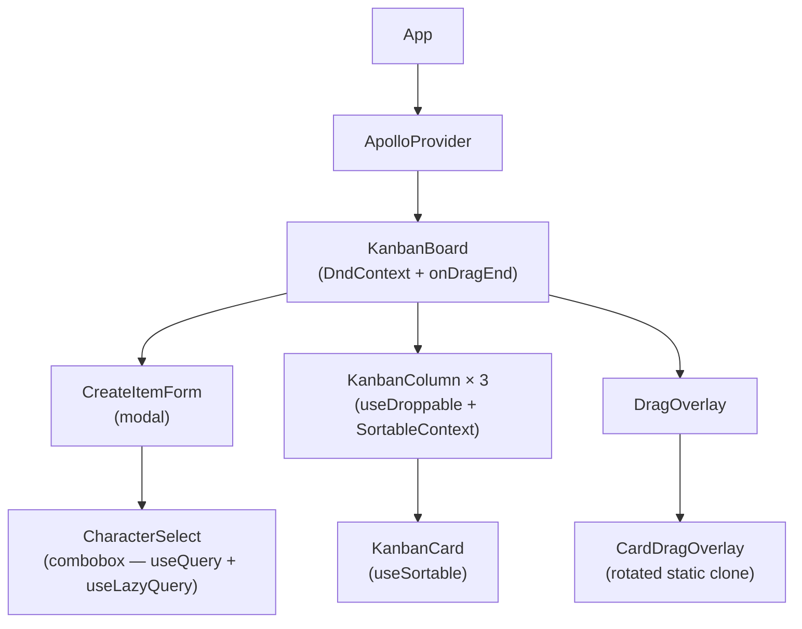
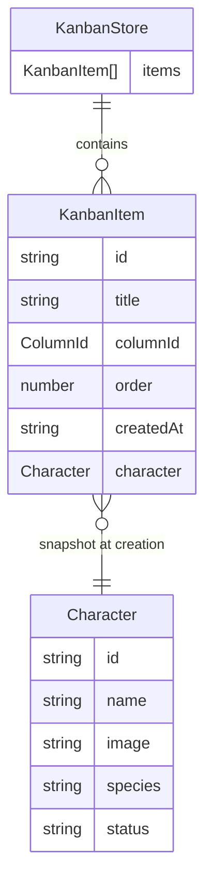

# Kanban Board — Healthie Pairing Interview

A frontend-only Kanban board with three columns (To Do, Doing, Done), Rick and Morty character assignment, drag-and-drop with reordering, and confetti when a card reaches Done.

https://github.com/user-attachments/assets/cc55c488-d1a3-48be-b501-703a652af857

## Running locally

```bash
pnpm install
pnpm dev
```

Requires Node 18+. No environment variables — the Rick and Morty GraphQL API is public.

## Tech stack

| Concern | Choice | Why |
| --- | --- | --- |
| Framework | React 19 + TypeScript + Vite | TypeScript is required; Vite's HMR keeps iteration fast |
| Styling | Tailwind CSS v4 | Utility-first means no context-switching between CSS files and JSX |
| GraphQL client | Apollo Client v4 | Healthie is GraphQL-first — Apollo is the production-idiomatic client; `useQuery` + `useLazyQuery` patterns translate directly |
| State | Zustand | Lightweight, no boilerplate; `persist` middleware makes localStorage a 3-line addition |
| Drag and drop | `@dnd-kit/core` + `@dnd-kit/sortable` | Actively maintained successor to react-beautiful-dnd, which breaks in React strict mode; accessible by default |
| Confetti | `canvas-confetti` | ~4 KB, imperative API wires cleanly into `onDragEnd` |

**Not chosen:**

- **Redux Toolkit** — overkill; Zustand achieves the same with far less surface area
- **TanStack Query** — would work for a single read-only query, but Apollo is the right signal for a GraphQL-first stack
- **react-beautiful-dnd** — unmaintained, breaks in React strict mode

## Architecture

### Component tree



### State shape



### Data flow

```mermaid
flowchart LR
    API["Rick & Morty\nGraphQL API"]
    Apollo["Apollo\nInMemoryCache"]
    CS["CharacterSelect"]
    Form["CreateItemForm"]
    Store["Zustand Store\n(items[])"]
    Col["KanbanColumn × 3"]
    Card["KanbanCard"]
    Dnd["dnd-kit\nDndContext"]
    Confetti["canvas-confetti"]

    API --> Apollo --> CS --> Form
    Form -->|"addItem(title, character)"| Store
    Store -->|"filtered by columnId"| Col --> Card
    Card -->|"drag event"| Dnd
    Dnd -->|"moveItem / reorderItems"| Store
    Dnd -->|"target === 'done'"| Confetti
```



### Key design decisions

**CharacterSelect as a search-as-you-type combobox.** The component owns fetch, search state, and debounce; the caller only passes `value` and `onChange`. The hook uses `useQuery` for the default page-1 list and `useLazyQuery` for debounced name-filter queries — the same pattern a production patient or provider picker would use. The Rick & Morty API's `filter: { name }` argument maps directly to what a real backend search endpoint would expose.

**Store is persistence-ready.** Adding `localStorage` persistence is a 3-line Zustand middleware wrap — no component changes required:

```ts
import { persist } from "zustand/middleware";
export const useKanbanStore = create<KanbanStore>()(
  persist((set) => ({ ... }), { name: "healthie-kanban" })
);
```

**Column config is data, not JSX.** Columns are defined in `src/types/kanban.ts` as `COLUMNS: { id: ColumnId; label: string }[]`. Adding a fourth column is a one-line array entry; the board, column styles, and `ColumnId` union all derive from it.

**Two caches, no overlap.** Apollo `InMemoryCache` holds character data from the API (deduplicated by `Character.id`). Zustand holds local board state. They never share data — the character object is snapshotted into the `KanbanItem` at creation time.

**Order field tradeoff.** The current implementation rebuilds integer order indices on every reorder — O(n) but simple and correct at this scale. For a production board with concurrent users or large lists, this would be replaced with fractional indexing (e.g. Lexorank) so each drop is O(1) and doesn't invalidate sibling order values.
